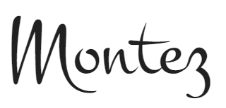

# [Kicassoo](https://jaycode88.github.io/Kicassoo/)

** amiresponsive image here **

Welcome to Kicassoo, the online showcase for an abstract artist. This website is dedicated to presenting the artist's profile and captivating collections. With a focus on artistic expression and creativity, Kicassoo offers visitors a glimpse into the vibrant world of contemporary art.

## Purpose
The primary purpose of the website is to establish a foundational online presence for the artist, offering a curated showcase of select collections. As a starting point, Kicassoo serves as a platform to introduce the artist's work to a wider audience and provide a glimpse into their creative vision.

With a focus on simplicity and elegance, the website aims to present a few key collections in a visually compelling manner. By showcasing these curated collections, we aim to capture the essence of the artist's style and inspire engagement and interest from visitors.

## UX
### Colour Scheme
we've opted for a simple black and white color scheme. This deliberate choice is intended to create a minimalist backdrop that allows the artwork to take center stage. By keeping the overall design subdued, we aim to highlight the vibrant colors and intricate details of the artwork featured on the site.

The monochromatic palette not only emphasizes the visual impact of the images but also lends a sense of sophistication and timelessness to the website's aesthetic. Additionally, the use of black and white provides a versatile canvas that allows the artwork to shine while ensuring readability and clarity of text and navigation elements.

By embracing simplicity in our color selection, we aim to create a cohesive and elegant visual experience that puts the focus squarely on the artistry and creativity of the showcased collections.

### Typography
#### Logo and Headings

For the logo and headings, we've chosen the "Montaga" font. This font exudes elegance and sophistication, making it the perfect choice to represent the artist's brand and to headline the various sections of the website. Its graceful curves and bold strokes command attention, while its timeless aesthetic adds a touch of refinement to the overall design.

#### Body Text

The body text is set in "Open Sans." This font was selected for its clean and modern appearance, which enhances readability across different devices and screen sizes. With its neutral yet friendly demeanor, Open Sans ensures that the content remains accessible and easy to digest, allowing visitors to focus on the artist's narrative and portfolio without distraction.

#### Accents

To add a hint of personality and flair to certain elements, we've incorporated "Montez" as our accent font. Montez's handwritten style brings a touch of whimsy and creativity to the website, serving as a playful counterpoint to the more structured fonts used elsewhere. This font is strategically employed for decorative purposes, such as embellishments or highlights, infusing the design with charm and character.

## User Stories

### As a User ...
... I want to be able to easily navigate around the application

... I want to access information about the Artist

... I want to view the Artist's Collections

... I want to view individual pieces from a collection

... I want to be able to easily make an enquiry

### As Site Owner

... I want a site personalised to me.

... I want to showcase my collections and pieces to my audience

... I want to be Accessible to my audience

## Wireframes

### Home

### Collections

### Collection Detail

## Features

## Deployment
## DEPLOYMENT
### Local Deployment
This project can be cloned or forked in order to make a local copy on your own system.

#### Cloning

You can clone this repository by following these steps:

1. Go to the [GitHub repository](https://github.com/Jaycode88/kicassoo) 
2. Locate the Code button above the list of files and click it 
3. Select if you prefer to clone using HTTPS, SSH, or GitHub CLI and click the copy button to copy the URL to your clipboard
4. Open Git Bash or Terminal
5. Change the current working directory to the one where you want the cloned directory
6. In your IDE Terminal, type the following command to clone my repository:
        - `git clone https://github.com/Jaycode88/kicassoo.git`
7. Press Enter to create your local clone.

Alternatively, if using Gitpod, you can click below to create your own workspace using this repository.

Please note that in order to directly open the project in Gitpod, you need to have the browser extension installed.
A tutorial on how to do that can be found [here](https://www.gitpod.io/docs/configure/user-settings/browser-extension)

#### Forking

By forking the GitHub Repository, we make a copy of the original repository on our GitHub account to view and/or make changes without affecting the original owner's repository.
    
You can fork this repository by using the following steps:

1. Log in to GitHub and locate the [GitHub Repository](https://github.com/Jaycode88/kicassoo)
2. At the top of the Repository (not top of page) just above the "Settings" Button on the menu, locate the "Fork" Button.
3. Once clicked, you should now have a copy of the original repository in your own GitHub account!

### Live Deployment

### Connecting to FormKeep

## Tools and Technologies used
- [HTML](https://en.wikipedia.org/wiki/HTML)  is the backbone of web content. It defines the structure and content of the web pages.
- [CSS](https://en.wikipedia.org/wiki/CSS) used to control the visual presentation of the web application. It defines the layout, colors, fonts etc.
- [Git](https://git-scm.com) used for version control. (`git add`, `git commit`, `git push`)
- [GitHub](https://github.com) used for secure online code storage.
- [Font Awesome](https://fontawesome.com/) For Icons
- [Google Fonts](https://fonts.google.com/) for all Fonts.
- [Responsinator](http://www.responsinator.com/) Used to check responsiveness.

## Bugs
### Open Issues
#### Logo *
All images provided for logo are not of good enough qaulity to pop on the site as they should. Alternative images needed.
This applies to Meta Icon also!
Result: I have enhanced one of the supplied Image which looks better atleast until an alternative is provided

### Solved bugs
#### Font package
When the user hovers over a button all text changes to clack except for the letter "N". I have diagnosed this to be a font package issue as when I load the buttons with a different font the problem does not exist. This issue can also be resolved keeping the "Montaga" Font but removing the transform to uppercase so the letters displayed are lowercase.
resolution remover uppercase transform.

## Further points to discuss before sign off

### Contact form
Needs completion to create send functionality either using formspree or to open client default mail application.
should add a message sent meesage upon completion!
Gcapture to prevent spam!

### About section *
Image needed 

### Collection Banner images *
Client to advise on canva designs.... 
Result: try to round images on new designs
- on kingdom change yellow text to forrest green

### Collection Deatail pages *
Image Dimensions?
Result: non bold, no word dimensions, dimensions tbc
