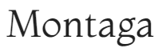

# Kicassoo
A website built for An Abstract Artist, The websites main purpose is to showcase The Artist's Profile and collections. Each Item in a collection is to show dimensions of the art piece but not any pricing or buying options instead there should be "Contact Me" calls to action for users to enquire regarding a collection or piece.

## User Stories

### As a User ...
... I want to be able to easily navigate around the application

... I want to access information about the Artist

... I want to view the Artist's Collections

... I want to view individual pieces from a collection

... I want to be able to easily make an enquiry

### As Site Owner

... I want a site personalised to me.

... I want to showcase my collections and pieces to my audience

... I want to be Accessible to my audience

## Typography

### Logo and Headings

### Body Text

### Accents

## Colour
It has Been Decided to keep the main colour them to Black and white as to not pull focus from the Art pieces displayed.
colour's for buttons and form backgrounds etc to be discussed.

## Wireframes

### Home

### Collections

### Collection Detail

## Bugs
### Open Issues
#### Logo *
All images provided for logo are not of good enough qaulity to pop on the site as they should. Alternative images needed.
This applies to Meta Icon also!
Result: I have enhanced one of the supplied Image which looks better atleast until an alternative is provided

### Solved bugs
#### Font package
When the user hovers over a button all text changes to clack except for the letter "N". I have diagnosed this to be a font package issue as when I load the buttons with a different font the problem does not exist. This issue can also be resolved keeping the "Montaga" Font but removing the transform to uppercase so the letters displayed are lowercase.
resolution remover uppercase transform.

## Further points to discuss before sign off

### Contact form
Needs completion to create send functionality either using formspree or to open client default mail application.
should add a message sent meesage upon completion!
Gcapture to prevent spam!

### About section *
Image needed 

### Collection Banner images *
Client to advise on canva designs.... 
Result: try to round images on new designs
- on kingdom change yellow text to forrest green

### Collection Deatail pages *
Image Dimensions?
Result: non bold, no word dimensions, dimensions tbc
