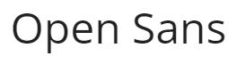
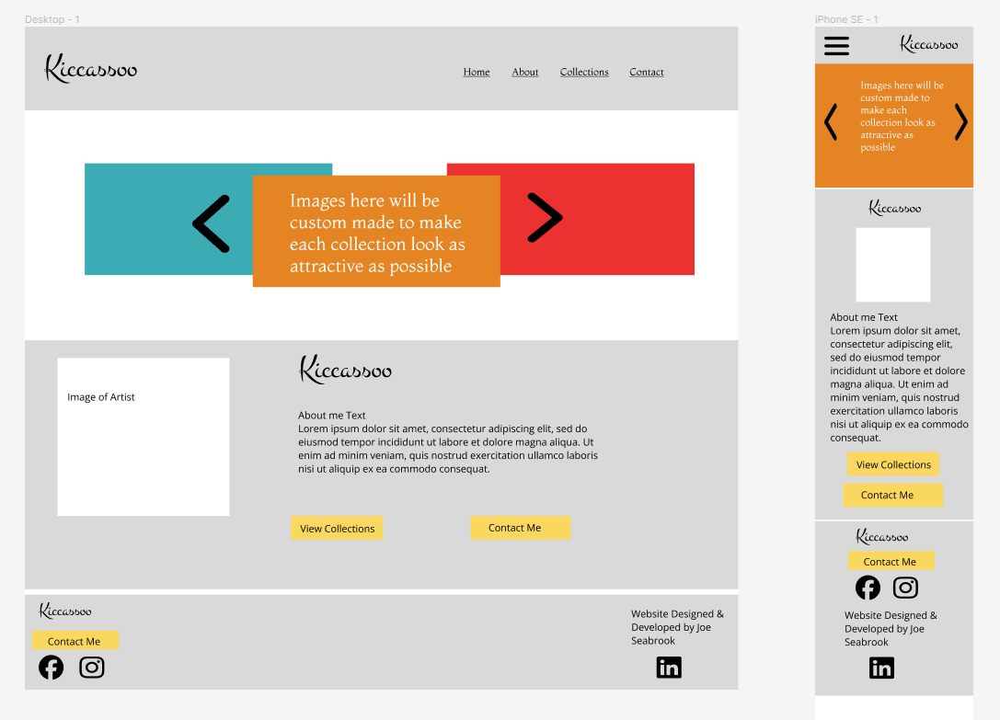
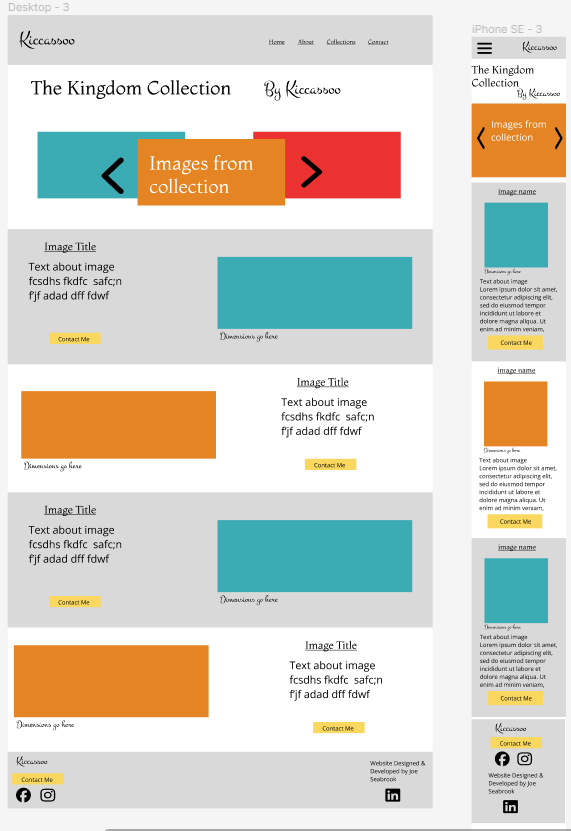
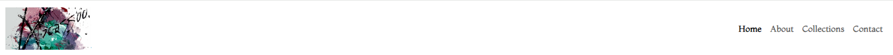
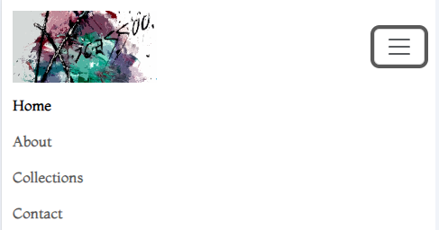
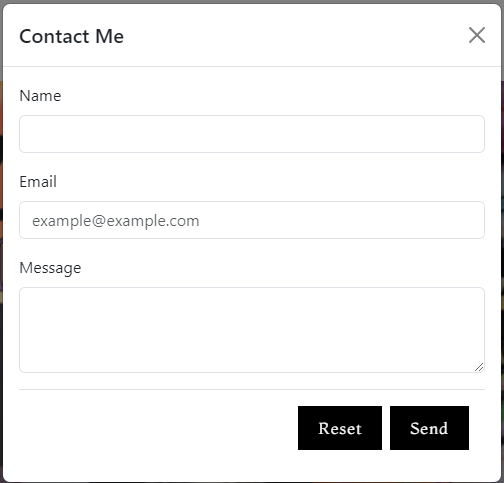
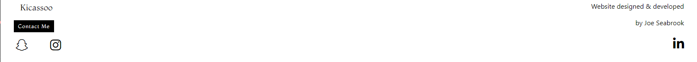
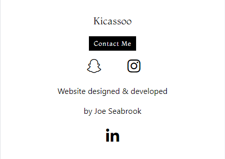

# [Kicassoo](https://jaycode88.github.io/Kicassoo/)

** amiresponsive image here **

Welcome to Kicassoo, the online showcase for an abstract artist. This website is dedicated to presenting the artist's profile and captivating collections. With a focus on artistic expression and creativity, Kicassoo offers visitors a glimpse into the vibrant world of contemporary art.

## Purpose
The primary purpose of the website is to establish a foundational online presence for the artist, offering a curated showcase of select collections. As a starting point, Kicassoo serves as a platform to introduce the artist's work to a wider audience and provide a glimpse into their creative vision.

With a focus on simplicity and elegance, the website aims to present a few key collections in a visually compelling manner. By showcasing these curated collections, we aim to capture the essence of the artist's style and inspire engagement and interest from visitors.

## UX
### Colour Scheme
we've opted for a simple black and white color scheme. This deliberate choice is intended to create a minimalist backdrop that allows the artwork to take center stage. By keeping the overall design subdued, we aim to highlight the vibrant colors and intricate details of the artwork featured on the site.

The monochromatic palette not only emphasizes the visual impact of the images but also lends a sense of sophistication and timelessness to the website's aesthetic. Additionally, the use of black and white provides a versatile canvas that allows the artwork to shine while ensuring readability and clarity of text and navigation elements.

By embracing simplicity in our color selection, we aim to create a cohesive and elegant visual experience that puts the focus squarely on the artistry and creativity of the showcased collections.

### Typography
#### Logo and Headings

For the logo and headings, we've chosen the "Montaga" font. This font exudes elegance and sophistication, making it the perfect choice to represent the artist's brand and to headline the various sections of the website. Its graceful curves and bold strokes command attention, while its timeless aesthetic adds a touch of refinement to the overall design.

#### Body Text

The body text is set in "Open Sans." This font was selected for its clean and modern appearance, which enhances readability across different devices and screen sizes. With its neutral yet friendly demeanor, Open Sans ensures that the content remains accessible and easy to digest, allowing visitors to focus on the artist's narrative and portfolio without distraction.

#### Accents

To add a hint of personality and flair to certain elements, we've incorporated "Montez" as our accent font. Montez's handwritten style brings a touch of whimsy and creativity to the website, serving as a playful counterpoint to the more structured fonts used elsewhere. This font is strategically employed for decorative purposes, such as embellishments or highlights, infusing the design with charm and character.

## User Stories

### As a User ...
... I want to be able to easily navigate around the application

... I want to access information about the Artist

... I want to view the Artist's Collections

... I want to view individual pieces from a collection

... I want to be able to easily make an enquiry

### As Site Owner

... I want a site personalised to me.

... I want to showcase my collections and pieces to my audience

... I want to be Accessible to my audience

## Wireframes

### Home

### Collections

### Collection Detail

## Features
### Responsiveness & Accessibility
The site has been built to be perfectly responsive accross all devices for 300px wide and up. Special care has been taken to ensure the correct size image is loaded for the correct device type ensuring lower load times and high performance. 
The site Has a 100% accessibility score, ensuring it is accesible to screen readers and other assitive technologies Therefore reaching wider audiences.

### Image Copy protection code
For security purposes to stop digital copright infrinement, Code has been added which disables the user's ability to use the right click options on images, These options include copy and save image as.. etc. Whilst this measure does not provide complete protection it acts as a detterrent to those casual attempts of image theft.

### Navigation
The website is built with clear and responsive navigation structure enabling user's to easily find their way around the site. The Navigation consists of the Kicassoo Logo as well as links to the sites pages/sections. When viewed on Smaller screen sizes the navigation links are found in a dropdown burger menu.

### Home Page
The home page consists of Am Image carousel hosting the collection images, As well as the About Me Section.

### About me
This section displays an image of the artist, as well as content decribing the artist and her journey.

### Collections
This page Features each of the artist's collections with a description, an image and a button to view the collection.

### Collection Gallery
Each Collection has its on gallery page to display the Art pieces from each collection, Here the user can find the Title and dimensions to the art pieces. This section has a call to action contact button for the user to make enquiries.

### Contact form Modal
The contact form Has been placed into a modal so that it can be accessed on any page. The backend to the form has been set up with [FormKeep](https://formkeep.com/). The form allows users to make direct contact with the artist. The from requests basic data such as the Name, Email address and the User's message. The form has security so that all fields must be entered before the form can be sent, this includes a check that the email is in the correct format. Once the User has sent a message a message success page opens in a new tab.
N.B Please see Deployment section for instuctions for [FormKeep](https://formkeep.com/) Setup etc.

### Footer 
This contains social links and contact button for Kicasso as well as Socail links for the site developer.

## Future features
Please See your future features proposal document(If you have not recieved this please contact your developer)

## Deployment
## DEPLOYMENT
### Local Deployment
This project can be cloned or forked in order to make a local copy on your own system.

#### Cloning

You can clone this repository by following these steps:

1. Go to the [GitHub repository](https://github.com/Jaycode88/kicassoo) 
2. Locate the Code button above the list of files and click it 
3. Select if you prefer to clone using HTTPS, SSH, or GitHub CLI and click the copy button to copy the URL to your clipboard
4. Open Git Bash or Terminal
5. Change the current working directory to the one where you want the cloned directory
6. In your IDE Terminal, type the following command to clone my repository:
        - `git clone https://github.com/Jaycode88/kicassoo.git`
7. Press Enter to create your local clone.

Alternatively, if using Gitpod, you can click below to create your own workspace using this repository.

Please note that in order to directly open the project in Gitpod, you need to have the browser extension installed.
A tutorial on how to do that can be found [here](https://www.gitpod.io/docs/configure/user-settings/browser-extension)

#### Forking

By forking the GitHub Repository, we make a copy of the original repository on our GitHub account to view and/or make changes without affecting the original owner's repository.
    
You can fork this repository by using the following steps:

1. Log in to GitHub and locate the [GitHub Repository](https://github.com/Jaycode88/kicassoo)
2. At the top of the Repository (not top of page) just above the "Settings" Button on the menu, locate the "Fork" Button.
3. Once clicked, you should now have a copy of the original repository in your own GitHub account!

### Live Deployment

### Connecting to FormKeep

- Create an account with [FormKeep](https://formkeep.com/)

## Tools and Technologies used
- [HTML](https://en.wikipedia.org/wiki/HTML)  is the backbone of web content. It defines the structure and content of the web pages.
- [CSS](https://en.wikipedia.org/wiki/CSS) used to control the visual presentation of the web application. It defines the layout, colors, fonts etc.
- [Git](https://git-scm.com) used for version control. (`git add`, `git commit`, `git push`)
- [GitHub](https://github.com) used for secure online code storage.
- [Font Awesome](https://fontawesome.com/) For Icons
- [Google Fonts](https://fonts.google.com/) for all Fonts.
- [Responsinator](http://www.responsinator.com/) Used to check responsiveness.
- [FormKeep](https://formkeep.com/) Used for contact form back end.

## Bugs
### Open Issues

### Solved bugs
#### Font package
I had an issue When the user hovered over a button, all the text changed to black except for the letter "N". I diagnosed this to be a font package issue as when I load the buttons with a different font the problem did not exist. The other option I found was to remove the text transform to uppercase class. 
I discussed with client which resolution they preffered and it was chosen to remove the uppercase transform.

#### Logo
I recieved an image to use as a logo but this was not of sufficient quality and did not look good on the preview site, I requested another image but this was poorly sized and pixelated.
I managed to get a much clearer image using image manipulation and AI software.

## Needed in able to sign off

### About section *
Image needed 

### Collection Banner images *
Client to advise on canva designs.... 
Result: try to round images on new designs
- on kingdom change yellow text to forrest green
Images re-designed now awaiting response

### Collection Gallery pages *
Image Dimensions?
Result: non bold, no word dimensions, dimensions tbc
Contact made, awaiting response

## Upon sign off

- Sign Customer upto FormKeep and transfer code so messages go to their account.
- Use customer gmail for Recaptcha security on form.
- Publish with chosen Host.